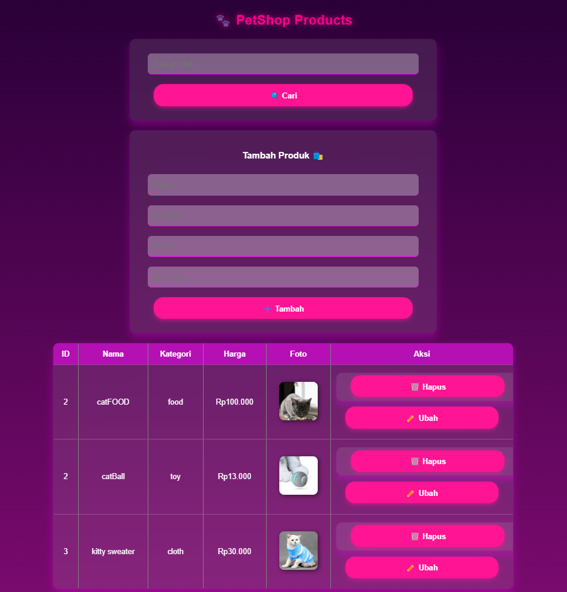

# Janji 
Saya Yusrilia Hidayanti dengan NIM 2306828 mengerjakan Latihan Modul 1 dalam mata kuliah Desain dan Pemrograman Berorientasi Objek untuk keberkahanNya maka saya tidak melakukan kecurangan seperti yang telah dispesifikasikan. Aamiin.

# Dokumentasi Output
Program dapat menambahkan, menampilkan, mengubah, menghapus dan mencari produk.

### Output program C++

### Output program Java:

### Output program Python:

### Output program PHP:
(Semua menu ada di halaman utama)

Tampilan halaman utama:

Menambahkan produk:

Mengubah produk:

Menghapus produk:

Mencari produk:

